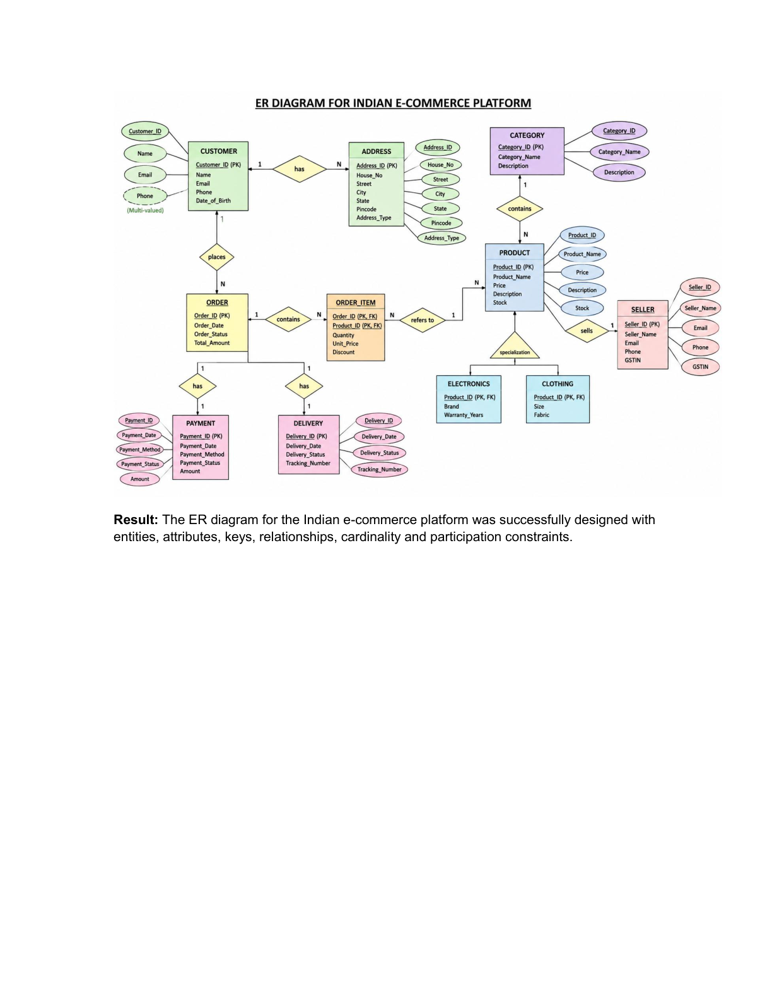

# Experiment 1: Design an ER Diagram for Indian E-Commerce Platform

## Aim
To design an ER (Entity-Relationship) diagram for an Indian e-commerce platform.

## Entities and Attributes

* **Customer**: Customer_ID (Primary Key), Name, Email, Phone
* **Product**: Product_ID (Primary Key), Product_Name, Price, Stock
* **Order**: Order_ID (Primary Key), Order_Date, Order_Status, Total_Amount
* **OrderItem**: Order_ID, Product_ID, Quantity, Unit_Price; Composite Key: (Order_ID, Product_ID)
* **Seller**: Seller_ID (Primary Key), Seller_Name, Email, Phone
* **Category**: Category_ID (Primary Key), Category_Name
* **Payment**: Payment_ID (Primary Key), Payment_Method, Payment_Status, Amount
* **Delivery**: Delivery_ID (Primary Key), Delivery_Date, Delivery_Status, Tracking_Number
* **Address**: Address_ID (Primary Key), City, State, Pincode, Address_Type

## Relationships

* Customer places Order &rarr; 1:N
* Customer has Address &rarr; 1:N
* Order contains OrderItem &rarr; 1:N
* Product belongs to Category &rarr; N:1
* Seller sells Product &rarr; 1:N
* Order has Payment &rarr; 1:1
* Order has Delivery &rarr; 1:1
* OrderItem refers to Product &rarr; N:1
* Product is specialized into Electronics and Clothing.

## ER Diagram

## Result
The ER diagram for the Indian e-commerce platform was successfully designed with entities, attributes, keys, relationships, cardinality and participation constraints.
